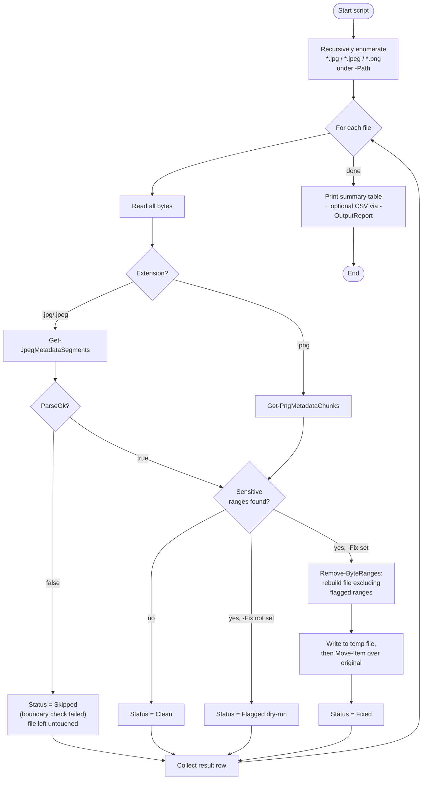
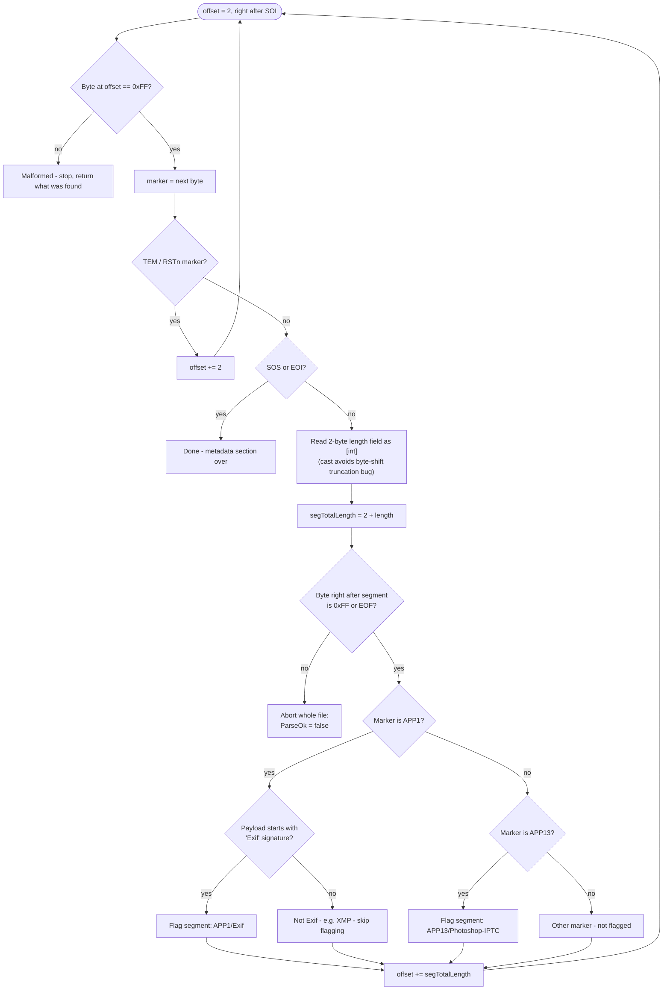
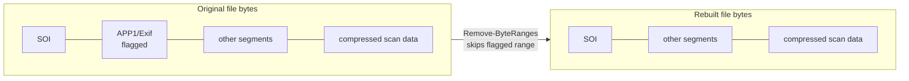

# Remove-ImageMetadata.ps1

Finds and (optionally) strips privacy-sensitive metadata from JPEG/PNG images under
`assets/images`, without re-encoding or otherwise touching the actual image pixels.

## Why

Photos straight from a phone or camera commonly embed metadata that isn't meant for
publication:

- **JPEG** `APP1` segments containing **Exif** data — GPS coordinates, capture
  timestamp, device make/model/software.
- **JPEG** `APP13` segments — Photoshop/IPTC resource blocks.
- **PNG** ancillary chunks — `tEXt`, `zTXt`, `iTXt`, `eXIf`, `tIME`.

This script detects and removes exactly those byte ranges, leaving the compressed
JPEG scan data / PNG pixel data completely untouched — so there is no quality loss
and no re-encoding.

## How it works



## JPEG segment walking (`Get-JpegMetadataSegments`)

JPEG files are a sequence of *markers* (`0xFF` + a marker code). Most markers are
followed by a 2-byte big-endian length and that many bytes of payload. The function
walks this structure from just after the `SOI` (`0xFFD8`) marker until it hits `SOS`
(start of compressed scan data) or `EOI`, flagging `APP1` segments that carry the
`Exif` identifier and any `APP13` (Photoshop/IPTC) segments.



### The boundary safety check

Before trusting any computed segment length, the parser verifies that the byte
immediately following the segment is either end-of-file or the start of a new
marker (`0xFF`). If it isn't, the file is left completely untouched and reported as
`Skipped: segment boundary check failed`, rather than risking a corrupt write.

This check exists because of a real bug found while building this script:
PowerShell's `-shl` operator on a `[byte]`-typed value shifts within that byte's own
8-bit width, so `$Bytes[x] -shl 8` always evaluates to `0` — silently discarding the
high byte of any length field above 255 and causing the parser to compute a length
far shorter than the real segment. The fix was to cast to `[int]` before shifting;
the boundary check remains in place as a permanent guard against any future
parsing edge case.

## PNG chunk walking (`Get-PngMetadataChunks`)

PNG files start with an 8-byte signature followed by a sequence of chunks, each
`length(4 bytes) + type(4 bytes ASCII) + data(length bytes) + CRC(4 bytes)`. The
function walks these chunks, flagging any of the ancillary metadata types
(`tEXt`, `zTXt`, `iTXt`, `eXIf`, `tIME`) for removal, and stops at `IEND`.

## Removing the flagged ranges (`Remove-ByteRanges`)

Once the sensitive ranges are known, `Remove-ByteRanges` rebuilds the file by
copying every byte *except* those ranges into a new in-memory buffer — no
recompression, no pixel data touched:



## Usage

```powershell
# Dry run: report only, nothing is changed
./scripts/Remove-ImageMetadata.ps1

# Strip the flagged metadata in place
./scripts/Remove-ImageMetadata.ps1 -Fix

# Scan/fix a specific folder or single file instead of the default assets/images
./scripts/Remove-ImageMetadata.ps1 -Path .\assets\images\kozijn -Fix

# Also write the findings to a CSV report
./scripts/Remove-ImageMetadata.ps1 -OutputReport .\metadata-report.csv
```

| Parameter       | Description                                                                 |
| --------------- | ---------------------------------------------------------------------------- |
| `-Path`         | Root folder (or single file) to scan. Defaults to `assets/images`.           |
| `-Fix`          | Actually strip flagged metadata and overwrite files. Default is dry-run.     |
| `-OutputReport` | Optional CSV path to also write the findings table to.                       |

## Result statuses

| Status                                          | Meaning                                                                 |
| ------------------------------------------------ | ------------------------------------------------------------------------ |
| `Clean`                                          | No privacy-sensitive metadata found.                                    |
| `Flagged (dry-run)`                              | Metadata found; `-Fix` not passed, file untouched.                      |
| `Fixed`                                          | Metadata found and removed; file overwritten.                           |
| `Skipped: segment boundary check failed...`      | Parser couldn't confidently determine segment boundaries; file untouched to avoid corruption. |
| `Error: ...`                                     | Unexpected error while processing the file (e.g. file I/O); file untouched. |

## Known limitations

- Only strips **metadata** (GPS/timestamp/device info). It cannot detect or redact
  privacy-sensitive *visual* content (faces, visible addresses/plates) — that needs
  manual review.
- Only covers `.jpg`, `.jpeg`, `.png`. Other formats are ignored.
- Does not rewrite git history — already-committed originals with metadata may
  still be reachable via old commits.
